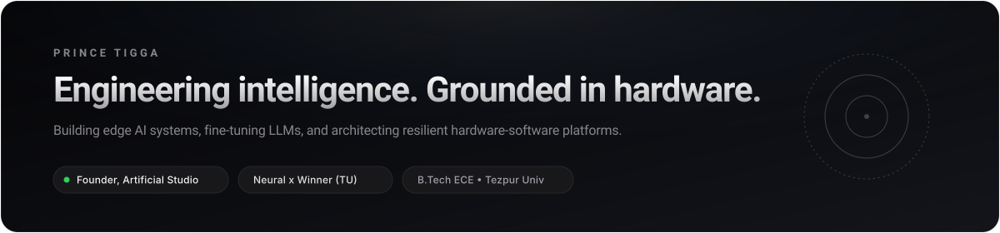

  

    

  <!-- Subtle Monochrome Navigation -->
  
  &nbsp;
  
  &nbsp;
  

 

  

## Overview

I am an **AI Engineer and Systems Architect** based in Guwahati, India, pursuing a **B.Tech in Electronics & Communication Engineering** at **Tezpur University**.

My work centers on the intersection of **machine intelligence and embedded hardware** — fine-tuning large language models (Gemma 3 4B), designing grounded Retrieval-Augmented Generation (RAG) pipelines, and building predictive edge-computing IoT systems.

- 🏆 **Hackathon Winner** — Neural x Hackathon, Tezpur University (AI Mental Health Platform)
- 🎖️ **Hackathon Finalist** — Dehradun Cyber Hackathon 2.0 (Cyber Police Digitization Platform)
- 🏢 **Founder** — [Artificial Studio](#-ventures--leadership) (Smart Hardware & Tech Community) & [Steady Pulse AI](#-ventures--leadership)
- 💻 **Open Source** — Regular contributor across 35+ GitHub repositories

 

  

## Core Expertise

### Artificial Intelligence & Machine Learning
`LLM Fine-Tuning (Gemma 3 4B)` • `Retrieval-Augmented Generation (RAG)` • `Autonomous AI Agents` • `PyTorch` • `Hugging Face` • `Python`

### Embedded Systems & Hardware Engineering
`Arduino UNO` • `ESP8266 Wi-Fi` • `HC-05 Bluetooth` • `C / C++` • `Edge Computing` • `PLC / SCADA` • `Circuit Prototyping`

### Software & Systems Development
`JavaScript` • `TypeScript` • `React` • `Android SDK` • `Git / GitHub` • `Railway Signaling & Telecom Systems`

 

  

## Flagship Projects

<table>
  <thead>
    <tr>
      <th width="35%">Project</th>
      <th width="45%">Description & Engineering</th>
      <th width="20%">Stack</th>
    </tr>
  </thead>
  <tbody>
    <tr>
      <td>
        <b>Neural x — AI Mental Health Platform</b> 
        🏆 <i>Winner, Neural x Hackathon (Tezpur Univ)</i>
      </td>
      <td>
        Gemma 3 4B fine-tuned conversational system supporting 50+ distinct AI personas. Implemented clinical RAG grounded in psychological counseling guidelines (S.S. Rao), the <i>Mindspace Hub</i> knowledge repository, and personal journaling.
      </td>
      <td>
        <code>Gemma 3</code> <code>RAG</code> 
        <code>Python</code> <code>PyTorch</code>
      </td>
    </tr>
    <tr>
      <td>
        <b>Cyber Police Digital Platform</b> 
        🎖️ <i>Finalist, Dehradun Cyber Hackathon 2.0</i>
      </td>
      <td>
        Case management and administrative digitization platform for cyber police departments. Integrated a custom NLP document comprehension engine to summarize case files, correlate investigations, and recommend next actions.
      </td>
      <td>
        <code>NLP</code> <code>Python</code> 
        <code>Workflow Engine</code>
      </td>
    </tr>
    <tr>
      <td>
        <b>Predictive Dual-Axis Solar Tracker</b> 
        <i>Kamrup Polytechnic</i>
      </td>
      <td>
        Dual-axis solar tracking system utilizing an edge-computing predictive algorithm connected to weather API feeds to anticipate cloud cover, eliminating motor hunting and boosting solar capture efficiency by up to 30%.
      </td>
      <td>
        <code>Arduino</code> <code>ESP8266</code> 
        <code>Edge AI</code> <code>C++</code>
      </td>
    </tr>
    <tr>
      <td>
        <b>Wireless Digital Notice Board</b> 
        <i>Hardware + Android Integration</i>
      </td>
      <td>
        Bluetooth-enabled notice distribution terminal with an Android companion app featuring real-time speech-to-text conversion for wireless updates over a secure Bluetooth PAN.
      </td>
      <td>
        <code>Arduino UNO</code> <code>HC-05</code> 
        <code>Android SDK</code>
      </td>
    </tr>
    <tr>
      <td>
        <b>U-DELT MVP</b> 
        <i>Universal Digital Twin for Education</i>
      </td>
      <td>
        Phase 1 MVP of a digital twin framework mapping and dynamically personalizing individual education and lifelong learning trajectories.
      </td>
      <td>
        <code>Python</code> <code>Data Modeling</code> 
        <a href="https://github.com/useriswild7099/U-DELT"><b>Repository →</b></a>
      </td>
    </tr>
    <tr>
      <td>
        <b>neo.ai</b> 
        <i>Intelligent AI Agent System</i>
      </td>
      <td>
        Autonomous AI agent architecture for workflow automation, task coordination, and intelligent conversational convenience.
      </td>
      <td>
        <code>AI Agents</code> <code>LLMs</code> 
        <a href="https://github.com/useriswild7099/neo.ai"><b>Repository →</b></a>
      </td>
    </tr>
  </tbody>
</table>

 

  

## Ventures & Leadership

- **Artificial Studio** — *Founder & Developer*  
  Designs and builds end-to-end custom smart electronic and embedded IoT hardware-software systems. Operates a collaborative tech community with 9 specialized sub-groups covering AI automation, software engineering, digital media, and business strategy.

- **Steady Pulse AI** — *Founder & Strategist*  
  Delivers AI-driven executive growth solutions and comprehensive business operational audits for high-value founders and executives.

- **Northeast Frontier Railway HQ, Maligaon** — *Field Engineering Intern (Signal & Telecom)*  
  Assisted in diagnostics, calibration, and maintenance of high-frequency electronic systems and telecommunication infrastructure.

 

  

## Engineering Activity

  <table border="0">
    <tr>
      <td align="center" width="50%">
        
      </td>
      <td align="center" width="50%">
        
      </td>
    </tr>
  </table>

   

  <picture>
    <source media="(prefers-color-scheme: dark)" srcset="https://raw.githubusercontent.com/useriswild7099/useriswild7099/output/github-contribution-grid-snake-dark.svg">
    <source media="(prefers-color-scheme: light)" srcset="https://raw.githubusercontent.com/useriswild7099/useriswild7099/output/github-contribution-grid-snake.svg">
    
  </picture>

 

  

## Connect

  

    <a href="https://linkedin.com/in/prince-tigga-95b123324/"><b>LinkedIn</b></a> &nbsp;•&nbsp; 
    <a href="mailto:Tiggaprince403@gmail.com"><b>Email</b></a> &nbsp;•&nbsp; 
    <a href="https://github.com/useriswild7099"><b>GitHub</b></a>
  

  Prince Tigga • Guwahati, India

